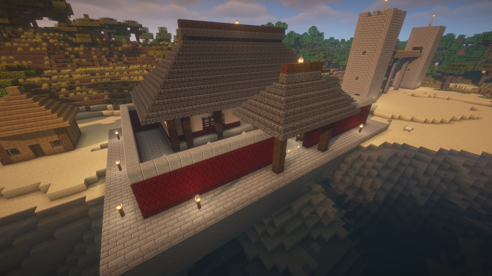
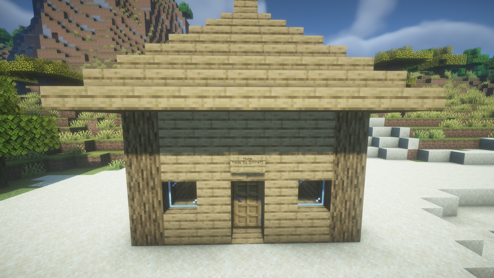

<p align="center"></p>

# Ashlar

[English](README.md) | **简体中文**

面向 Minecraft Paper 服务器的 AI 建造工具 —— 不需要 SSH，不需要局域网世界：一个 jar 包加一个 URL。



*由 Claude 通过本 MCP 建造。*

Ashlar 由一个 Paper 插件和一个 Node MCP 服务器组成。把 Claude Desktop、Claude Code、OpenCode、Cursor 或任何其他支持 MCP 的 AI 客户端指向这个 MCP 服务器，它就能获得九个工具：勘测地形、渲染世界图像、批量建造、检查精确的方块数据、快照/恢复区域，以及执行控制台命令。不需要模组，不需要 SSH 访问主机，也不需要在自己的机器上运行世界：插件运行在你现有的 Paper 服务器内部（面板托管的服务器也可以），通过 WebSocket 与 MCP 服务器通信。完全没有 MCP 客户端的玩家也可以直接在聊天里输入 `/ashlar <请求>`，由插件自带的助手来回答 —— 这条路径不需要 Node 进程或入站端口；见下方的[游戏内助手](#游戏内助手不需要-ai-客户端)。

## 工作原理

```
AI client                MCP server                 Paper plugin
(Claude/ChatGPT/...)     (Node, mcp-server/,         (Java, plugin/ - owns the
                          a protocol adapter)         tool layer: descriptions,
                                                       schemas, result text,
                                                       execution)

   mc_* tool call  --->  tool_catalog/tool_call  --->   main-thread block
   (stdio or HTTP)       over WebSocket RPC             writes, tick-budgeted
                         (ws:// / wss://)
        <---  text/image result  <---  JSON result / progress events

player's /ashlar  --->  plugin's built-in assistant  --->  model API (DeepSeek by default)  --->  same tools above
```

工具层完全存在于插件里，而不在 MCP 服务器里：`ashlar-mcp` 启动时从插件获取工具目录（描述、JSON Schema 以及服务器级别的说明文本），然后只是转发调用，因此每个工具只有一份定义，被任意 MCP 客户端和游戏内助手共用。`/ashlar` 这条路径完全不需要 Node 进程，也不需要入站端口：插件直接调用模型 API（一个出站的 HTTPS 连接），并运行 MCP 适配器所转发的同一套进程内工具层。

- 粗粒度工具：一次 `mc_build` 调用最多可放置 500,000 个方块，而不是让 AI 一个一个地放。
- 所有方块编辑都在服务器主线程上运行，并按每 tick 的时间预算分摊到多个 tick，因此大型建造不会卡住服务器或让玩家掉帧。
- 写入期间关闭物理效果（沙子不会掉落，水不会流动）；写入之后会执行一次连接处理，让栅栏、玻璃板、墙、楼梯等与相邻方块正确连接，任何失去支撑的方块都会作为警告报告回来，而不是悄悄弹飞。
- `mc_build` 可以在写入前对受影响区域做快照，因此任何建造都可以用 `mc_restore` 回滚。

## 工具列表

| 工具 | 作用 |
|---|---|
| `mc_status` | 服务器/插件健康状况和队列长度。 |
| `mc_players` | 在线玩家及其位置和朝向（"here"、"in front of me"、"at my feet"）。 |
| `mc_survey` | 对 x/z 区域的地形勘测：高度图图像加精确数字（最小/最大/中位高度、地表构成、最大平地区域）；`format:"text"` 输出 ASCII 地图。 |
| `mc_render` | 一个区域的 PNG 图像：俯视图、南北东西立面、切片，或高度图（俯视图/高度图按面积计价，y 范围任意）。 |
| `mc_build` | 批量放置方块（cuboid 填充，模式有 replace/keep/outline/hollow/walls，也支持单个方块、告示牌文字，以及通过 `text` 由插件渲染的文字/字母）；唯一会真正建造的工具。 |
| `mc_inspect` | 一个区域的精确方块内容（统计信息、ASCII 切片、告示牌文字）。 |
| `mc_snapshot` | 在改动前保存一个区域（或列出已保存的快照）。 |
| `mc_restore` | 把一个区域回滚到某个快照。 |
| `mc_command` | 执行一条服务器控制台命令并返回其输出（应急出口）。 |

典型流程：`mc_players`（如果请求与某玩家相关）-> `mc_survey` 或 `mc_render` 查看现场 -> `mc_snapshot` -> `mc_build` -> `mc_render`/`mc_inspect` 验证 -> 出错则 `mc_restore`。坐标约定：X 向东增大，Z 向南增大，Y 向上增大；`from`/`to` 两个角点都是闭区间（包含在内）。

## 安装（三步）

### 1. 安装插件

1. 从 [Releases](../../releases) 页面下载 `ashlar-0.4.9.jar`，放进服务器的 `plugins/` 目录。
2. 启动服务器一次，然后停止。插件在这第一次运行时会拒绝完全启动 —— 它会写出默认的 `plugins/Ashlar/config.yml` 并自我禁用，因为 token 是空的。
3. 编辑 `plugins/Ashlar/config.yml`：
   - `mode`：这台服务器怎么用 —— `both`（默认：MCP 客户端和 `/ashlar` 都开）、`mcp`（只给 MCP 客户端）、`ingame`（只有 `/ashlar`）或 `external`（见[游戏内助手](#游戏内助手不需要-ai-客户端)）。**只在游戏内用 `/ashlar`、不接 AI 客户端？** 设 `mode: ingame`，跳过下面几项直接看那一节：不会开放任何端口，也不需要 token。
   - `server.token`：一个足够长的随机值，例如 `openssl rand -hex 24`。**除非 `mode` 是 `ingame`，缺失或短于 16 个字符时插件会拒绝启动。**
   - `server.port`：主机/面板上一个空闲的 TCP 端口。
   - `server.allowed-ips`：可选。如果 MCP 服务器运行在有固定公网 IP 的地方（例如 VPS），把那个 IP 填在这里。如果它运行在你自己的电脑上、走的是普通家庭宽带，你的 IP 会变化，白名单反而会把你自己锁在外面 —— 留空，依赖 token 本身即可，token 才是真正的身份验证。留空意味着什么、以及如何在此基础上进一步收紧，见[安全性](#安全性)。
4. 重启服务器。

### 2. 在客户端机器上准备好 Node

不需要手动安装任何东西。下面的客户端配置会用 `npx -y ashlar-mcp` 启动 MCP 服务器，它会在第一次运行时从 npm 下载并缓存；唯一的要求是运行 AI 客户端的机器上有 **Node >= 22**。（`ashlar-mcp` 0.4 需要 0.3 或更新的插件版本，否则会退出并给出明确提示。如果你想要一个固定路径，也可以运行一次 `npm install -g ashlar-mcp`，然后把配置指向生成的 `ashlar-mcp` 可执行文件。）

### 3. 连接客户端

#### Claude Desktop

编辑 `claude_desktop_config.json`（设置 -> Developer -> Edit Config），加入：

```json
{
  "mcpServers": {
    "ashlar": {
      "command": "/absolute/path/to/npx",
      "args": ["-y", "ashlar-mcp", "--stdio"],
      "env": {
        "MC_PLUGIN_URL": "ws://<your-server-ip>:8765",
        "MC_PLUGIN_TOKEN": "<the token from config.yml>"
      }
    }
  }
}
```

`npx` 请使用绝对路径（`which npx`）—— Claude Desktop 不会继承你 shell 的 PATH。添加服务器后，打开它的 "Tool access" 设置并选择 **"Tools already loaded"**；另一个选项 "Load tools when needed" 在实践中并不可靠（模型最终可能只看到一两个 `mc_*` 工具）。Claude Desktop 会为每个已配置的连接器启动两个 MCP 服务器实例 —— 这是正常现象，无害。

#### Claude Code

```sh
claude mcp add --scope user --transport stdio ashlar \
  -e MC_PLUGIN_URL=ws://<your-server-ip>:8765 \
  -e MC_PLUGIN_TOKEN=<the token from config.yml> \
  -- npx -y ashlar-mcp --stdio
```

#### OpenCode

加到 `opencode.json`（项目根目录，或全局 `~/.config/opencode/opencode.json` 对所有项目生效）：

```json
{
  "$schema": "https://opencode.ai/config.json",
  "mcp": {
    "ashlar": {
      "type": "local",
      "command": ["npx", "-y", "ashlar-mcp", "--stdio"],
      "environment": {
        "MC_PLUGIN_URL": "ws://<你的服务器 IP>:8765",
        "MC_PLUGIN_TOKEN": "<config.yml 里的 token>"
      },
      "enabled": true
    }
  }
}
```

项目级的 `opencode.json` 里带着 token，注意不要提交进 git（或者改用全局文件）。如果连的是下面的 HTTP 模式，改用 `"type": "remote"`，加 `"url": "http://<主机>:3000/mcp"` 和 `"headers": {"Authorization": "Bearer <MCP_HTTP_TOKEN>"}`。

#### 远程/HTTP 模式（用于 VPS 上托管的 MCP 服务器）

让 MCP 服务器本身以 HTTP 而不是 stdio 方式运行，例如与面板托管的 Paper 服务器放在同一台 VPS 上：

```sh
MC_PLUGIN_URL=ws://127.0.0.1:8765 \
MC_PLUGIN_TOKEN=<plugin token> \
MCP_HTTP_TOKEN=<a second, separate long random token> \
npx -y ashlar-mcp --http
```

能够发送自定义请求头的客户端使用 `Authorization: Bearer <MCP_HTTP_TOKEN>` 对 `POST /mcp` 进行认证。不能设置请求头的客户端（例如只能配置一个 URL 的远程 MCP 连接器）可以改用 `POST /mcp/<MCP_HTTP_TOKEN>`，把 token 放进路径里。`GET /healthz` 不需要认证，报告 MCP 服务器当前是否与插件保持着活动连接。

在 HTTP 端口前面放一个负责终止 TLS 的反向代理 —— 服务器本身只说明文 HTTP。Claude Desktop 的远程连接器设置要求 HTTPS。一个最小的 [Caddy](https://caddyserver.com/) 配置一行就能做到：

```
mcp.example.com {
    reverse_proxy 127.0.0.1:3000
}
```

## 第一次建造

一个完整的例子。用户说：

> Survey the area around me and build a small stone cottage with glass windows and a sign over the door saying "Home". Snapshot first.

模型依次调用的工具：

1. **`mc_players`** `{}` —— 找到调用者所在的方块坐标，例如 `pos: [104, 65, -212]`，以及朝向。
2. **`mc_survey`** `{ "from": [84, -232], "to": [124, -192] }` —— 以玩家为中心的 40x40 区域；返回一张高度图图像，以及类似 `Largest flat zone (+/-1 block): 12x9 at x=98..109 z=-220..-211, y=65.` 的文本。
3. **`mc_snapshot`** `{ "action": "create", "from": [98, 64, -220], "to": [109, 71, -211] }` —— 捕获建造区域；返回一个类似 `snap-20260914-101532-7c2a` 的快照 id。
4. **`mc_build`**：用几组 `fills`（地板、通过 `mode: "walls"` 建的墙、屋顶）以 `minecraft:stone_bricks` 建造，再用第二组带 `minecraft:glass` 的 `fills` 开出窗洞，加一条 `blocks` 放 `minecraft:oak_door`，再加一条放告示牌（`minecraft:oak_wall_sign[facing=south]`，`sign.front: ["Home"]`），放在门框上方的空气方块里。
5. **`mc_render`** `{ "from": [98, 64, -220], "to": [109, 71, -211], "view": "south" }` —— 一张立面图，用来检查结果。

如果门或告示牌最终背后没有实心方块支撑，`mc_build` 的响应文本末尾会出现这样一段：

```
WARNINGS (blocks that would fall or pop off in vanilla, including ones next to something you just removed; physics is disabled so they stay - fix them):
  1x minecraft:oak_wall_sign[facing=south] at 103,68,-215: no solid block behind it
```

模型应该读取这段内容并修复被标记的方块（或者解释这么做的取舍），然后再告诉用户建造已经完成 —— 物理效果被关闭意味着没有东西会自己掉落。



## 游戏内助手（不需要 AI 客户端）

以上内容都需要玩家自己的机器上有一个 AI 客户端。`/ashlar <请求>` 是另一条路径：插件在自己的进程内部运行助手本身，使用同样的九个工具 —— 不需要任何人安装 Claude Desktop、Claude Code、Cursor 或其他 MCP 客户端，也不需要单独的 Node 进程。这是为服务器上完全不使用 AI 客户端的玩家和朋友准备的 —— 服主设置一个 API key 并支付模型 API 的费用，其他人只需要在聊天里打字。

### 设置

1. **只需要插件。** 在 `plugins/Ashlar/config.yml` 里把 `agent.model.api-key` 设为一个来自 [platform.deepseek.com](https://platform.deepseek.com) 的 DeepSeek key（默认值已经指向 `deepseek-flash`），重启服务器，`/ashlar` 就能用了 —— 不需要运行任何其他进程：

   ```yaml
   mode: both                # 默认：MCP 客户端和 /ashlar；"ingame" = 只有 /ashlar，不开端口、不需要 token
   agent:
     model:
       api-key: "sk-..."     # 必填；留空时 /ashlar 会回复"未配置"
   ```

   助手是否运行由顶层的 `mode` 决定：
   - `both`（默认）—— 给 MCP 客户端用的 WebSocket 服务器**加上**助手，助手由插件自己用下面的 `agent.model.*` 运行；`/ashlar` 不需要 Node 进程。
   - `ingame` —— 只有助手：没有 WebSocket 服务器，不开端口，不需要 `server.token`。
   - `mcp` —— 只有 WebSocket 服务器；`/ashlar` 禁用。
   - `external` —— WebSocket 服务器开着，`/ashlar` 请求通过插件的聊天事件转发给一个已连接的 `ashlar-mcp` 风格进程，供集成方使用；这是之前 0.2 版本的方式。
2. **任何兼容 OpenAI 的接口**都可以用，只需把 `agent.model.base-url` 和 `agent.model.model` 换成对应的值（OpenAI、OpenRouter、本地 Ollama），只要该模型支持 tool calling 即可。建议使用支持视觉的模型：否则助手看不到 `mc_render`/`mc_survey` 返回的图像，只能看到其中的文字。
3. **谁可以使用它**按以下顺序决定（与 0.2 版本相同）：
   - 管理员（operator）始终可以使用。
   - 权限插件明确授予或拒绝 `ashlar.use` 的结果优先（例如用 LuckPerms 执行 `/lp user <name> permission set ashlar.use true`；明确的 `false` 会阻止该玩家，即使他在下面的允许列表中）。
   - 否则由插件自己的允许列表决定：`/ashlar allow <player>`、`/ashlar deny <player>`、`/ashlar allowed`（仅限管理员；保存在 `plugins/Ashlar/allowed-players.yml`）。对于没有任何权限插件的朋友服务器，这就够用了。
   - `agent.everyone-can-use: true` 会让所有玩家都能使用 `/ashlar`（每日限额和冷却依然生效）。默认 `false`。

### 使用方法

```
/ashlar build a small stone cottage in front of me
```

`/ashlar ask <请求>` 是同一件事的另一种写法 —— 当请求恰好以某个命令词（`usage`、`cancel`、`limit` 等）开头时使用它。Tab 补全会列出该玩家可用的子命令，并自动补全玩家名。

玩家会看到带 `[Ashlar]` 前缀的进度行（`> mc_survey ...`、`> mc_build ...`），随后是最终回复。`/ashlar cancel` 会停止正在进行的请求（它在两次工具调用之间生效，而不是在一次调用内部）。`/ashlar undo` 无需任何模型调用即可撤销玩家自己上一次助手建造的内容——它会恢复该玩家自己的请求所创建的最新快照（MCP 客户端创建的快照不受影响），并将其标记为已撤销，因此再次 `/ashlar undo` 会继续撤销上一步；产生了快照的回复会在页脚里给出提示。后续请求会记住最近的对话 —— 只记住玩家问了什么、助手最终答复了什么（坐标、材料、快照 id），绝不记住中间的工具调用过程 —— 所以"把屋顶再加高一点"这样的话不需要重复整段描述，同时上下文也保持很小；`/ashlar reset` 会忘记它并重新开始。回复所使用的语言与请求本身的语言一致。拥有 `ashlar.monitor` 权限（默认 op）的玩家会看到其他玩家每条请求和最终回复的简要回声 —— `"<name> asked: ..."` 以及带 `[Ashlar -> <name>]` 前缀的回复，但看不到进度行；可以用 `agent.echo-to-monitors: false` 关闭。

从服务器控制台（不需要玩家在线），`ashlar simulate <x> <y> <z> [朝向] <请求>` 会让一次请求走同样的代码路径，进度和最终回复打印到控制台而不是聊天 —— 这是在没有玩家在线时测试助手的方式：

```
ashlar simulate 100 64 -200 south build a small stone cottage
```

### 用量、花费与限额

每条最终回复末尾都有一行页脚，例如 `(this request: 21.9k tokens, $0.0061 | today: $0.04 of $1.00)` —— 没有花费上限时会省略 `of $1.00`，当每个 `agent.pricing.*` 价格都是 `0`（免费/本地模型）时会显示 token 数而不是花费。用量、每个玩家的限额覆盖以及全局暂停标志都会持久化到 `plugins/Ashlar/usage.json`，重启也不会丢失。

拥有 `ashlar.admin` 权限（默认 op）的玩家可以使用以下游戏内命令（`/ashlar help` 会列出调用者能用的那些）：

- **`/ashlar usage [player|all]`** —— 不带参数时显示调用者自己的用量；给出玩家名则显示该玩家的；`all` 列出每个用过助手的玩家，按今日花费排序（前 20 名，若还有更多会给出提示）。每份报告都显示今日和累计的请求数/token 数/花费，以及生效的每日限额及其中哪些是覆盖值。
- **`/ashlar usage [player|all] <天数>`** / **`/ashlar usage [player|all] <起始日期> <结束日期>`** —— 按天输出报告，而不是今日/累计汇总：最近 *N* 天（1-31，截止到今天）或一个明确的闭区间日期范围（同样最多 31 天；反过来写的 `from`/`to` 会被自动交换，未来的日期会被限制为今天）。不带玩家名的单纯范围是调用者自己的用量 —— 与上面带目标的形式不同，这种情况不需要 `ashlar.monitor`，只需要 `ashlar.use`。日期可以写成 `YYYY-MM-DD`、`YYYYMMDD`，或 `MM-DD`/`M-D`（当前 UTC 年份的月/日）；范围两端可以混用不同写法。例如 `/ashlar usage 7`：
  ```
  Usage for Steve, 2026-09-08..2026-09-14:
  2026-09-08  0 req  0 tok  $0.00
  2026-09-09  0 req  0 tok  $0.00
  2026-09-10  3 req  41.2k tok  $0.02
  2026-09-11  0 req  0 tok  $0.00
  2026-09-12  5 req  102.4k tok  $0.05
  2026-09-13  0 req  0 tok  $0.00
  2026-09-14  1 req  9.8k tok  $0.01
  total: 9 req, 153.4k tok, $0.08
  ```
- **`/ashlar limit [player] <cost|tokens|requests> <value|off>`** / **`/ashlar limit [player] reset`** —— 设置（或清除）一个每日上限。不指定玩家时设置的是服务器默认值；`off` 表示无限制。优先级：玩家自己的覆盖值 > 服务器默认值 > `agent.limits.*` 配置值。
- **`/ashlar pause`** / **`/ashlar resume`** —— 一个全局开关；暂停期间，每个新的 `/ashlar` 请求都会被拒绝并提示原因，已经在运行的请求不受影响。
- **`/ashlar cancel <player>`** —— 取消另一个玩家正在运行或排队中的请求（玩家自己的 `/ashlar cancel` 依然可用）；目标玩家会被告知是谁取消的。
- **`/ashlar allow <player>`** / **`/ashlar deny <player>`** / **`/ashlar allowed`** —— 插件自己的允许列表（见"设置"）。
- **`/ashlar credit <player>`** / **`/ashlar credit <player> <add|set> <amount>`** / **`/ashlar credit <player> off`** —— 管理某玩家的预付额度（见下方"预付额度"）。
- **`/ashlar reload`**（控制台也可用 `ashlar reload`）—— 重新读取 `config.yml`，绝大多数配置项立即生效，无需重启；config.yml 中每个配置项都标注了 `Reload` 或 `Restart`，改动了的 `Restart` 项会在回复中列出，但仍需要重启才能生效。文件无效时会返回错误，且当前运行的配置保持不变。

#### 预付额度

上面的每日限额是运营者自己的安全阀，只在请求开始前检查。额度不一样：它是别人的钱，所以在请求开始前*以及*请求运行期间都会被检查。用 `/ashlar credit <player> add <amount>` 给玩家充值（增加余额，如果额度是关闭的会顺带打开），或用 `/ashlar credit <player> set <amount>` 直接把余额设为某个值；`/ashlar credit <player> off` 再次关闭它；`/ashlar credit <player>` 不带其他参数则显示余额。没有开启额度的玩家完全不受这一切影响 —— `/ashlar usage` 和回复页脚只在玩家有额度时才会显示额度这一行。

余额在每次模型轮次之后扣除，与用量计数器采用同样的按轮计费方式。如果请求仍在运行时余额降到零，请求不会被硬生生截断，而是优雅收尾：正在进行的工具调用先完成，然后模型获得最后一轮、不带任何工具的机会，说明已完成了什么、还剩什么，以及快照 id —— 与请求触达 `agent.model.max-tool-calls` 时的处理方式相同。最终回复会多出一行，提示玩家请管理员充值，然后说 "continue"。当余额已经小于或等于零时开始一个*新*请求会被直接拒绝，和其他限额一样。每日限额依然会和额度一起生效 —— 两者都会被检查。余额和上面的一切一样，保存在同一个 `plugins/Ashlar/usage.json` 里。

`plugins/Ashlar/config.yml` 中的 `agent.limits.*` 和 `agent.pricing.*`（仅游戏内助手使用）：

| Key | Default | Meaning |
|---|---|---|
| `agent.model.max-tool-calls` | `25` | 每个玩家请求允许的最大工具调用次数，超过后强制给出最终答复。 |
| `agent.limits.max-requests-per-player-per-day` | `40` | 每个玩家每日请求次数上限，UTC 午夜重置；`0` = 无限制。可通过 `/ashlar limit` 按玩家覆盖。 |
| `agent.limits.max-tokens-per-player-per-day` | `0` | 每个玩家每日 token 上限（输入 + 缓存 + 输出）；`0` = 无限制。可按玩家覆盖。 |
| `agent.limits.max-cost-per-player-per-day` | `0` | 每个玩家每日花费上限，单位是 `agent.pricing.currency`；`0` = 无限制。可按玩家覆盖。 |
| `agent.model.allow-command` | `false` | 是否把 `mc_command` 纳入助手的工具列表。 |
| `agent.limits.max-concurrent` | `2` | 所有玩家合计同时运行的请求数。 |
| `agent.limits.history-turns` | `6` | 每个玩家记住的用户/助手对话轮数。 |
| `agent.limits.history-ttl-minutes` | `30` | 玩家历史记录在空闲多少分钟后被丢弃。 |
| `agent.model.image-detail` | `"high"` | 图像部分传递的细节级别：`low`/`high`/`auto`。 |
| `agent.model.system-prompt-file` | `""`（无） | 追加到内置系统提示词后面的文本文件的可选路径。 |
| `agent.model.request-timeout-ms` | `120000` | 单次模型调用超时时间，单位毫秒。 |
| `agent.pricing.input` | `0.30` | 每 100 万未缓存输入 token 的价格，峰值价格（已验证的 DeepSeek `deepseek-flash` 费率，2026-09-14）。 |
| `agent.pricing.cached-input` | `0.006` | 每 100 万缓存输入 token 的价格，峰值价格。 |
| `agent.pricing.output` | `1.20` | 每 100 万输出 token 的价格，峰值价格。 |
| `agent.pricing.currency` | `"USD"` | 仅作标签用：`USD` 显示为 `$`，其他值显示为 `<code> ` 前缀。 |
| `agent.pricing.peak-hours` | `"mon-fri 01:00-04:00,06:00-10:00"` | `agent.pricing.*` 价格完全生效的 UTC 时间窗口 —— DeepSeek 自己的峰值时段。`always` 表示不提供非峰值折扣的服务商可以禁用该折扣。 |
| `agent.pricing.off-peak-multiplier` | `0.5` | `agent.pricing.peak-hours` 之外应用的价格倍数。 |

一座小屋（勘测、快照、建造、几次渲染、一条最终回复 —— 大约十几次模型调用）消耗了约 32 万 prompt token，主要是工具描述和每次调用返回的图像，DeepSeek 峰值价格下约 $0.05（非峰值时段减半）；据此预算 `agent.limits.max-cost-per-player-per-day` —— 上限设为 `1`（一美元）大约可以覆盖峰值价格下 20 次这样的请求。

### 安全

- 除非运营者设置 `agent.model.allow-command: true`，否则 `mc_command` 永远不会提供给模型。
- `agent.limits.max-requests-per-player-per-day`、`agent.limits.max-tokens-per-player-per-day` 和 `agent.limits.max-cost-per-player-per-day` 限定单个玩家每天能花多少；管理员（`ashlar.admin`）可以在游戏内聊天中为某个玩家收紧或放宽任意一项，也可以直接暂停整个助手。
- 插件的 `agent.cooldown-seconds` 和 `agent.max-message-length` 在请求到达助手之前就对单条 `/ashlar` 请求做限流和长度限制。
- 使用 `world.build-region`（见[配置参考](#配置参考)）圈定助手可以建造的范围，就像对待一个人类建造者一样。
- 助手会在建造前对区域做快照，因此糟糕的结果可以用 `mc_restore` 回滚 —— 让它自己恢复，或者你自己执行 `mc_restore`。
- `agent.model.system-prompt-file` 可以给内置系统提示词追加自定的规则，例如一个包含 `Never build within 50 blocks of spawn.` 这类内容的文件。

### 从 0.2 升级

- 停止旧的、基于 Node 的助手进程 —— 曾经用来启动它的那个标志已经不存在了，现在会立即退出并提示改用内置助手。
- 如果想保留用量计数，把旧的用量文件（在那个旧进程曾经运行的目录旁边）复制到 `plugins/Ashlar/usage.json`（格式相同）。
- 把旧进程的 provider/limit/pricing 环境变量的值迁移到 `plugins/Ashlar/config.yml` 里对应的 `agent.model.*`/`agent.limits.*`/`agent.pricing.*` 键 —— 具体键名见上表和[配置参考](#配置参考)。
- 如果仍然想要一个独立进程驱动 `/ashlar`（例如自定义集成），设 `mode: external` —— 这就是旧的 0.2 行为。

## 兼容性

| Component | Status |
|---|---|
| Paper 26.2 | 已测试（build 124） |
| Paper 26.3 | 已测试（build 5，alpha 频道 —— 同一个 jar，`api-version` 保持 26.2） |
| Paper 26.x | 预期可用（同一条主要 API 线） |
| Java | 需要 25（Paper 26.x 的硬性要求） |
| Node | 需要 >= 22（MCP 服务器使用内置的 `WebSocket` 全局对象） |
| MCP clients | 任何 MCP SDK v2 客户端：Claude Desktop、Claude Code、OpenCode、Cursor 等。 |
| `ashlar-mcp` <-> plugin | `ashlar-mcp` 0.4 需要插件 >= 0.3.0（启动时通过 `tool_catalog` 获取工具目录，否则会退出并给出明确提示）；插件 0.3+ 仍然提供 `ashlar-mcp` 0.2 客户端使用的每一个 RPC，因此旧版 `ashlar-mcp` 在新版插件上依然可用。 |
| In-game assistant | 只需插件（不需要 Node），只要设置了 `agent.model.api-key`。 |
| Language | 插件聊天文本：英文或简体中文（`config.yml` 里的 `language`），或跟随每个玩家自己的客户端语言（`auto`）。AI 自身的回复始终跟随请求本身所使用的语言，与这项设置无关。 |

**不支持：** Minecraft 1.21.x 及更早版本（不同的 Paper API 版本）、Folia（全篇假设单一主线程调度模型）、Bedrock Edition。

## 安全性

**插件的 WebSocket 端口是一个拥有完整建造权限、并可选拥有命令执行权限的远程控制台。** 请把这个 token 当作 root 密码对待。

- 设置一个足够长的随机 `server.token`（>= 16 个字符；插件会强制这一点，否则拒绝启动）。`openssl rand -hex 24` 是个不错的生成方式。
- `server.allowed-ips` 是第二层防护，不是第一层：真正对客户端做身份验证的是 token（握手失败或缺失会在 5 秒内被关闭）。当 MCP 服务器有固定 IP（例如 VPS）时设置这个白名单。当它运行在动态 IP 的家用电脑上时，不要把今天的地址钉死在这里，留空即可；如果仍然想加固，可以用主机的防火墙/面板规则，或者把两台机器放进一个私有的 overlay 网络（Tailscale、WireGuard），只允许那个地址段。
- 插件本身**不**提供 TLS。在公开互联网上使用明文 `ws://` 会把 token 暴露给路径上的任何人 —— 只适合本地/局域网测试。任何跨越不受信任网络的场景，都应该在前面放一个反向代理（Caddy、Nginx、Cloudflare Tunnel 等）来终止 TLS（`wss://`），MCP 服务器自己的 HTTP 模式同理。
- 如果不需要 `mc_command` 这个应急出口，禁用 `run-command.enabled` —— 它以完整的运营者权限执行任意控制台命令。
- 当 `logging.log-operations` 打开时，每个已执行的操作都会追加到 `plugins/Ashlar/operations.log`（IP、方法、摘要、改动的方块数）作为审计记录。
- `limits.*` 限定单次调用能触及多少（方块数、区块数、读取体积）；`world.allowed-worlds` 和可选的 `world.build-region` 限定它能在哪里发生。请根据你实际希望 AI 能做到什么来配置这些项。
- 内置助手把聊天变成了一个控制通道，谁能使用 `/ashlar` 就能让它调用助手拥有的每一个工具，如果 `agent.model.allow-command: true` 甚至包括 `mc_command`。授予 `ashlar.use`（或允许列表中的一席之地）时要像授予运营者权限一样谨慎，公开服务器上请保持 `agent.everyone-can-use` 关闭。`config.yml` 里的模型 API key（`agent.model.api-key`）应该和服务器 token 一样对待 —— 任何能读到它的人都能把你的模型 API 账单刷上去。

## 配置参考

### 插件（`plugins/Ashlar/config.yml`）

| Key | Default | Meaning |
|---|---|---|
| `language` | `"en"` | 插件自身在聊天中所说的一切所用的语言（用法/帮助行、进度行、用量页脚、限额/额度/暂停消息）；不影响 AI 自己的回复。取值 `en`、`zh_CN`，或 `auto`（跟随每个玩家自己的客户端语言，控制台始终为英文）。 |
| `mode` | `"both"` | 这台服务器怎么用：`both` = WebSocket 服务器（MCP 客户端）加游戏内助手；`mcp` = 只有 WebSocket 服务器，`/ashlar` 禁用；`ingame` = 只有 `/ashlar`，不开 WebSocket 服务器、不开端口、不需要 token；`external` = WebSocket 服务器开着，`/ashlar` 转发给已连接的外部进程（0.2 方式）。取代原来的 `agent.mode`（没有 `mode` 时仍会读取它）。 |
| `server.host` | `"0.0.0.0"` | WebSocket 服务器绑定的网卡接口。 |
| `server.port` | `8765` | WebSocket 服务器的 TCP 端口。 |
| `server.token` | `""` | 给 MCP 客户端用的认证 token；必须 >= 16 个字符，否则插件拒绝启动（`mode: ingame` 时不检查）。 |
| `server.allowed-ips` | `[]` | 客户端精确 IP 的白名单（IPv4/IPv6，v1 不支持 CIDR/主机名）。空列表 = 允许任意 IP。 |
| `limits.max-blocks-per-operation` | `500000` | 单次 `fill_batch`/`set_blocks` 请求最多可触及的方块数。 |
| `limits.max-read-volume` | `200000` | `read_region`/`heightmap` 单次调用最多可返回的区域体积。 |
| `limits.tick-budget-ms` | `20` | 建造任务每个服务器 tick 允许消耗的最大毫秒数。 |
| `limits.max-queued-operations` | `16` | 同时最多可排队的操作数，超过后新的会被拒绝。 |
| `limits.max-chunks-per-operation` | `1024` | 单次操作的包围盒最多可强制加载的 16x16 区块列数（1024 区块的上限覆盖 512x512 的方块footprint）。 |
| `world.default` | `"world"` | 请求未指定 `world` 时使用的世界名。 |
| `world.allowed-worlds` | `["world"]` | 操作允许触及的世界名白名单。 |
| `world.build-region.enabled` | `false` | 是否进一步把建造限制在一个包围盒内。 |
| `world.build-region.min` / `.max` | `{x:-1000,z:-1000}` / `{x:1000,z:1000}` | 启用时的包围盒。 |
| `snapshot.enabled` | `true` | 是否提供 `mc_snapshot`/`mc_restore`。 |
| `snapshot.max-snapshots` | `20` | 磁盘上保留的快照数量；最旧的会被优先清除。 |
| `snapshot.max-volume` | `200000` | 单次快照最多可捕获的区域体积。 |
| `logging.log-operations` | `true` | 是否把已执行的操作追加到 `operations.log`。 |
| `run-command.enabled` | `true` | 是否提供 `run_command`/`mc_command` 这个应急出口。 |
| `engine.connect-blocks` | `true` | 写入后是否执行仅改变形状的连接处理（玻璃板/栅栏/墙/铁栏杆/楼梯与相邻方块连接）。可通过 `mc_build` 的 `connect` 字段按请求覆盖。 |
| `engine.support-warnings` | `true` | 写入后是否检查失去支撑的悬挂方块（作为警告报告，不会自动修复任何东西）。不支持按请求覆盖。 |
| `engine.text-font-file` | `""` | `mc_build` 的 `text` 条目用于非 ASCII（中日韩）文字的 `.ttf`/`.otf`/`.ttc` 字体文件路径，替代这个 JVM 的系统字体。留空保持现有行为；相对路径相对于插件数据目录解析。路径无效时只会记录一条警告并回退到系统字体，绝不会导致服务器无法启动。 |
| `agent.model.base-url` | `"https://api.deepseek.com"` | 兼容 OpenAI 的 base URL；会自动追加 `/chat/completions`。仅游戏内助手使用（`mode: both`/`ingame`）。 |
| `agent.model.api-key` | `""` | 模型 API 的 Bearer token。游戏内助手必填 —— 留空时 `/ashlar` 会回复"未配置"，而不是插件拒绝启动。 |
| `agent.model.model` | `"deepseek-flash"` | 每次请求发送的模型名。仅游戏内助手使用（`mode: both`/`ingame`）。 |
| `agent.model.max-tool-calls` | `25` | 每个玩家请求允许的最大工具调用次数，超过后强制给出最终答复。仅游戏内助手使用（`mode: both`/`ingame`）。 |
| `agent.model.request-timeout-ms` | `120000` | 单次模型 API 调用超时时间，单位毫秒。仅游戏内助手使用（`mode: both`/`ingame`）。 |
| `agent.model.image-detail` | `"high"` | 图像部分传递的细节级别：`low`/`high`/`auto`。仅游戏内助手使用（`mode: both`/`ingame`）。 |
| `agent.model.system-prompt-file` | `""` | 追加到内置系统提示词后面的文本文件的可选路径。仅游戏内助手使用（`mode: both`/`ingame`）。 |
| `agent.model.allow-command` | `false` | 是否把 `mc_command` 作为工具提供给模型。仅游戏内助手使用（`mode: both`/`ingame`）。 |
| `agent.limits.max-requests-per-player-per-day` | `40` | 每个玩家每日请求次数上限，UTC 午夜重置；`0` = 无限制。可通过 `/ashlar limit` 按玩家覆盖。仅游戏内助手使用（`mode: both`/`ingame`）。 |
| `agent.limits.max-tokens-per-player-per-day` | `0` | 每个玩家每日 token 上限（输入 + 缓存 + 输出）；`0` = 无限制。可按玩家覆盖。仅游戏内助手使用（`mode: both`/`ingame`）。 |
| `agent.limits.max-cost-per-player-per-day` | `0` | 每个玩家每日花费上限，单位是 `agent.pricing.currency`；`0` = 无限制。可按玩家覆盖。仅游戏内助手使用（`mode: both`/`ingame`）。 |
| `agent.limits.max-concurrent` | `2` | 所有玩家合计同时运行的请求数。仅游戏内助手使用（`mode: both`/`ingame`）。 |
| `agent.limits.history-turns` | `6` | 每个玩家记住的用户/助手对话轮数。仅游戏内助手使用（`mode: both`/`ingame`）。 |
| `agent.limits.history-ttl-minutes` | `30` | 玩家历史记录在空闲多少分钟后被丢弃。仅游戏内助手使用（`mode: both`/`ingame`）。 |
| `agent.pricing.input` | `0.30` | 每 100 万未缓存输入 token 的价格，峰值价格。仅游戏内助手使用（`mode: both`/`ingame`）。 |
| `agent.pricing.cached-input` | `0.006` | 每 100 万缓存输入 token 的价格，峰值价格。仅游戏内助手使用（`mode: both`/`ingame`）。 |
| `agent.pricing.output` | `1.20` | 每 100 万输出 token 的价格，峰值价格。仅游戏内助手使用（`mode: both`/`ingame`）。 |
| `agent.pricing.currency` | `"USD"` | 仅作标签用：`USD` 显示为 `$`，其他值显示为 `<code> ` 前缀。仅游戏内助手使用（`mode: both`/`ingame`）。 |
| `agent.pricing.peak-hours` | `"mon-fri 01:00-04:00,06:00-10:00"` | `agent.pricing.*` 价格完全生效的 UTC 时间窗口；`always` 禁用非峰值折扣。仅游戏内助手使用（`mode: both`/`ingame`）。 |
| `agent.pricing.off-peak-multiplier` | `0.5` | `agent.pricing.peak-hours` 之外应用的价格倍数。仅游戏内助手使用（`mode: both`/`ingame`）。 |
| `agent.cooldown-seconds` | `5` | 同一玩家两次 `/ashlar` 请求之间的最短间隔秒数。 |
| `agent.max-message-length` | `500` | `/ashlar` 请求文本接受的最大字符数。 |
| `agent.everyone-can-use` | `false` | 是否让每个玩家都能使用 `/ashlar`，而不必是管理员、被授予权限，或在允许列表中。 |
| `agent.echo-to-monitors` | `true` | 拥有 `ashlar.monitor` 权限的玩家是否看到其他玩家 `/ashlar` 请求和最终回复的简要回声（不含进度行）。 |

### MCP 服务器（环境变量）

| Variable | Required | Default | Meaning |
|---|---|---|---|
| `MC_PLUGIN_URL` | 必需 | - | Paper 插件的 WebSocket URL，例如 `ws://127.0.0.1:8765`。必须以 `ws://` 或 `wss://` 开头。 |
| `MC_PLUGIN_TOKEN` | 必需 | - | 必须与插件 `config.yml` 中的 `server.token` 一致。 |
| `MC_REQUEST_TIMEOUT_MS` | 否 | `600000` | 等待插件响应的单次请求超时时间，单位毫秒。 |
| `MC_LOG_USAGE` | 否 | 默认开启 | 设为 `0` 可停止向 stderr 输出每次调用的大小/token 估算日志。 |
| `MC_USAGE_LOG` | 否 | 默认关闭 | 每次工具调用追加一行的 JSONL 文件路径（供 `tools/overlay.mjs` 使用）。 |
| `MCP_HTTP_HOST` | 仅 `--http` | `127.0.0.1` | 绑定的网卡接口。 |
| `MCP_HTTP_PORT` | 仅 `--http` | `3000` | 绑定的端口。 |
| `MCP_HTTP_TOKEN` | 仅 `--http` | - | MCP 客户端必须提供的 Bearer token。必需，>= 16 个字符。 |
| `MCP_ALLOWED_HOSTS` | 仅 `--http`，且未绑定到 localhost 时 | - | Host/Origin 请求头中允许的主机名，逗号分隔。一旦 `MCP_HTTP_HOST` 不是 `localhost`/`127.0.0.1`/`::1` 就必须提供。 |

游戏内助手自身不再需要任何环境变量 —— 见上表插件部分的 `agent.*` 键。

## 故障排查

**症状：** 连接以代码 1006 关闭，对插件端口执行 `curl` 返回一个 HTML "domain not whitelisted" 页面。
**原因：** 某些托管商会按 `Host` 请求头过滤纯 HTTP 流量，拒绝任何非可识别域名的请求，包括发往一个 IP 的原始 WebSocket 升级请求。
**修复：** 把 `MC_PLUGIN_URL` 设为服务器的原始 IP 地址，而不是域名。

**症状：** Claude 只看到一两个 `mc_*` 工具，而不是九个。
**原因：** Claude Desktop 的 "Load tools when needed" 设置会懒加载工具定义，且并不可靠。
**修复：** 把连接器的工具访问设置切换为 "Tools already loaded"，或者开一个新对话。

**症状：** 插件日志提示 token 为空（或过短），插件没有启动。
**原因：** `config.yml` 里的 `server.token` 是空的、只有空白字符，或短于 16 个字符。
**修复：** 设置一个真实的 token（`openssl rand -hex 24`）并重启——如果只会用 `/ashlar`，也可以设 `mode: ingame`。

**症状：** `mc_render` 报 `VOLUME_EXCEEDED` 错误。
**原因：** 立面/切片视图按体积计价（<= 200,000 方块）；过高或过深的 `from`/`to` 范围很容易超出这个限制。
**修复：** 只需要平面轮廓时改用 `top` 或 `heightmap` 视图（按面积计价，y 范围任意），或者把 `y` 范围收缩到结构实际的高度。

**症状：** 建造之后沙子、火把、梯子、告示牌或地毯变得悬空或消失了。
**原因：** 物理效果按设计是关闭的（这样才能做出有意的悬挑和悬浮平台）；失去支撑的方块不会被自动修正。
**修复：** 阅读 `mc_build` 响应中的 `WARNINGS` 部分 —— 它精确列出了哪些方块缺少支撑以及原因。

**症状：** `/ashlar` 提示助手未配置。
**原因：** `mode` 是 `both`（默认值）或 `ingame`，但 `config.yml` 里的 `agent.model.api-key` 是空的。
**修复：** 把 `agent.model.api-key` 设为一个真实的 key 并重启。

**症状：** 控制台显示 `Ashlar agent: mode=external`，但 `/ashlar` 没有任何回应。
**原因：** `mode: external` 会把请求转发给一个已连接的外部进程，而不是在插件内部运行助手；当前没有任何进程连接。
**修复：** 要么连接一个订阅插件聊天事件的 `ashlar-mcp` 风格外部进程，要么设 `mode: both`（大多数服务器的常规设置）。

**症状：** `mc_build` 的 `text` 报错说这台服务器的 Java 没有某个字符（通常是中日韩文字）的字体，尤其是在 Docker 容器里。
**原因：** JVM 只在启动时读取一次系统字体列表，而容器镜像通常根本没有装中日韩字体。
**修复：** 最快的办法——把手头已有的 `.ttf` 挂载进容器，把 `engine.text-font-file` 指向它，然后执行 `/ashlar reload`（不需要重启）。否则就安装系统字体（Debian/Ubuntu：`apt install fonts-noto-cjk`）并重启服务器，或者把字体打进 Docker 镜像里。

**症状：** 模型的回复说它看不到图像，或者回答得就像从未看过勘测/渲染结果一样。
**原因：** `agent.model.model` 不支持视觉，因此随 `mc_render`/`mc_survey` 结果一起发送的图像对它来说等于不存在。
**修复：** 换用支持视觉的模型，或者接受助手只能依据 `mc_survey` 响应中的纯文本数字工作。

**症状：** 需要查看上述问题对应的 MCP 服务器日志。
**修复：** Claude Desktop 的 MCP 服务器日志位于：
  - macOS：`~/Library/Logs/Claude/mcp-server-ashlar.log`
  - Windows：`%APPDATA%\Claude\logs\mcp-server-ashlar.log`
  - Linux：`~/.config/Claude/logs/mcp-server-ashlar.log`

## 统计 token 用量

每次工具调用都会向 stderr 记录一行，包含大小和一个粗略的 token 估算（文本按约 4 字符/token，图像按 `width*height/750`）：

```
[tool 60695] mc_survey: 812 ms, image 1024x1024 (~1398 tokens) + 240 chars (~60 tokens) = ~1458 tokens
```

设置 `MC_LOG_USAGE=0` 可以关闭这些日志行。设置 `MC_USAGE_LOG=<path>` 还会把每次调用追加为文件中的一行 JSON，不依赖客户端是否保留 stderr（对 Claude Code 或制作电子表格很有用）。

如果想在录制或直播时看到实时的屏幕计数器，运行这个零依赖的 OBS 叠加层：

```sh
node mcp-server/tools/overlay.mjs
```

它会按操作系统自动检测 Claude Desktop 的日志文件（或读取 `MC_USAGE_LOG`/`--file`），并在 `http://127.0.0.1:4545/` 提供一个透明页面，可作为 OBS 浏览器源添加。访问一次 `.../?reset=1` 可以为新的一段录制清零累计值。

## 开发

```sh
# plugin (JDK 25 required)
cd plugin && JAVA_HOME=/opt/homebrew/opt/openjdk@25 ./gradlew build --no-daemon   # produces build/libs/ashlar-<version>-dev.jar; the release workflow builds the bare version
JAVA_HOME=/opt/homebrew/opt/openjdk@25 ./gradlew runServer --no-daemon   # local Paper test server in plugin/run

# mcp-server
cd mcp-server && env -u HTTP_PROXY -u HTTPS_PROXY npm install --omit=optional
env -u HTTP_PROXY -u HTTPS_PROXY npm run build && env -u HTTP_PROXY -u HTTPS_PROXY npm test
node tools/e2e.mjs        # end-to-end check against a running plugin test server
```

项目结构：`plugin/` 是一个独立的 Gradle 项目（Paper 插件，Java 25）；`mcp-server/` 是一个独立的 npm 项目（TypeScript，MCP SDK v2）。两侧遵循相同的硬性规则：Bukkit API 只能在主线程、在按 tick 计预算的执行器内使用；方块写入只通过 `setBlockData(data, false)`；请求在入队前已在网络线程上完全验证；不使用 NMS/反射；源码保持纯 ASCII。

工具层完全位于 `plugin/` 之下：每个 `mc_*` 工具是 `plugin/src/main/java/cc/wujm/ashlar/tool/mc/` 下的一个 Java 类，其描述和 JSON Schema 是 `plugin/src/main/resources/tools/<name>.json` 中的一个资源文件，发送给模型的服务器级说明文本是 `plugin/src/main/resources/tools/instructions.txt`。要修改某个工具的描述、schema 或说明文本，直接编辑对应的资源文件即可 —— MCP 客户端和游戏内助手都会自动获取，因为二者都通过插件的 `tool_catalog`/`tool_call` RPC，任何一方都不会硬编码自己的工具知识。结果文本的格式化（标题、警告、ASCII 地图、错误文本）位于 `plugin/src/main/java/cc/wujm/ashlar/tool/text/`；`plugin/src/test/resources/goldens/` 下的 golden 文件是该格式的基准，格式变化时应当有意识地更新它们，而不是悄悄改动。

## 路线图

**v0.4：**
- 建造过程中的取消：目前 `/ashlar cancel` 只在两次工具调用之间生效，无法在一次 `mc_build` 填充内部生效。
- 为内置助手提供原生 Anthropic 格式的 provider，与现有的兼容 OpenAI 的 chat-completions provider 并存。

**v0.5：**
- 面向世界/玩家事件的事件总线，以及按 token 划分的作用域（一个 token 可以被限制到部分工具/世界，而不是全有或全无）。

**v1.1：**
- 确定性的颜色着色，让共享同一种 Minecraft 地图颜色的方块（例如石头/石砖/圆石）在 `mc_render`/`mc_survey` 图像中可以区分。
- `mc_inspect` 切片：把方块类型合并的上限从目前的 47 种不同类型往上提，并加一个可选的 `focus` 参数来高亮某一种方块类型。
- 快照捕获方块实体的内容（告示牌文字、容器物品），使 `mc_restore` 不会丢失它们。
- `server.allowed-ips` 支持 CIDR 范围（目前只支持精确 IP）。

**v2（候选，尚未承诺）：**
- `set_blocks`/`read_region` 中的方块实体内容：容器内容（箱子/漏斗/发射器/熔炉）、命令方块文本。
- 兼容 WorldEdit 的 `.schem` 导入/导出，作为可选依赖。
- 参数化的结构生成器（球体、柱子、屋顶、螺旋楼梯）。
- 一个可选的"红石域"（`mc_interact` 用于切换拉杆/按钮并在数个 tick 内采样方块状态，`mc_entities` 用于列出运动部件），用来真正测试红石建筑，而不只是摆放它们。
- 插件内置 MCP 端点（Paper 插件直接说 MCP，本地/单人设置就完全不需要 `mcp-server` 了）—— 评估中，尚未承诺。

## 许可证

AGPL-3.0-or-later（见 `LICENSE`）。简单来说：如果你在一台供他人通过网络交互的服务器上运行本项目的修改版本，你必须向他们提供该修改版本的源码 —— 与 GPL 相同的 copyleft，只是把覆盖范围从"分发"扩展到了"网络使用"。如果你 fork 了 MCP 服务器或插件、把它作为托管服务的一部分运行，这一点尤其相关。

欢迎贡献。在接受外部 pull request 之前会先添加一份 CLA。
